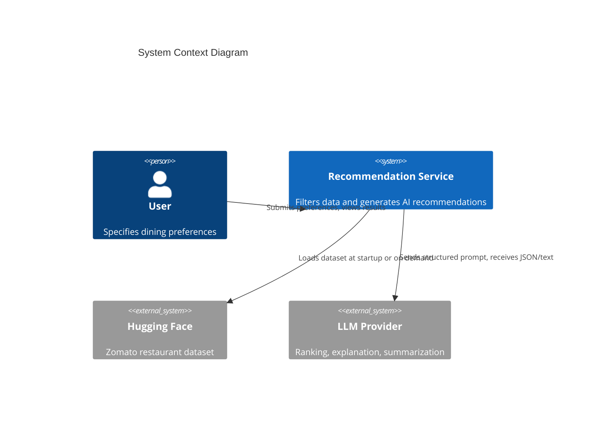
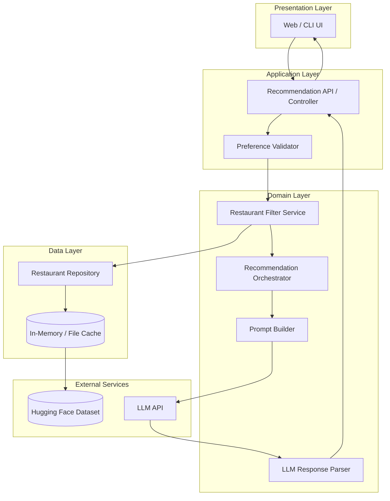
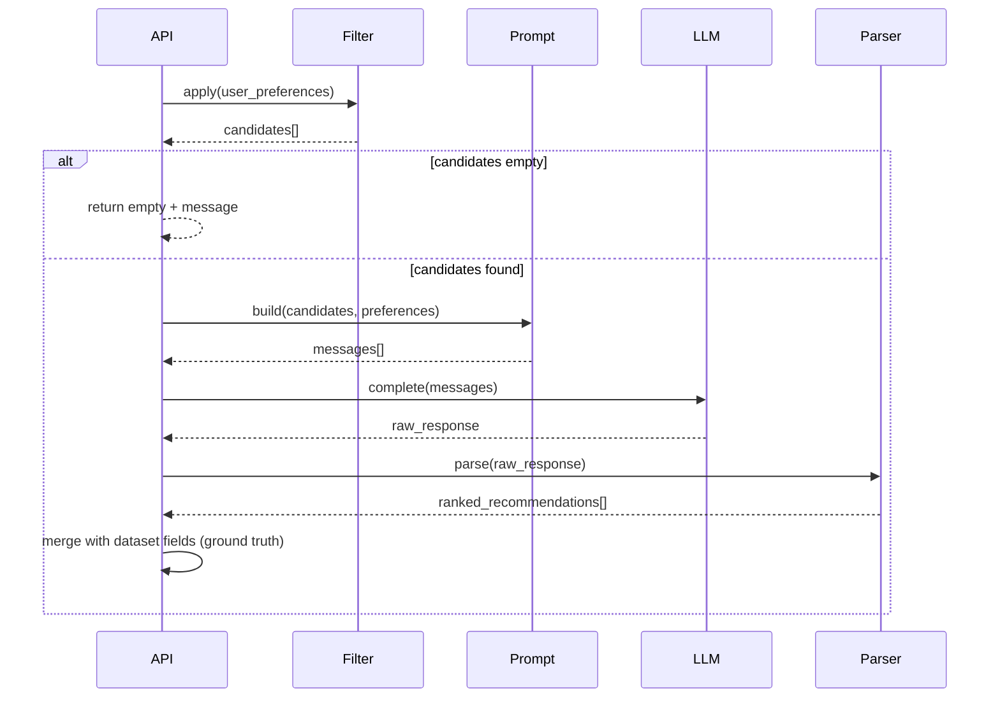
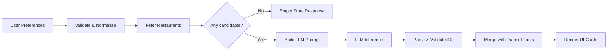
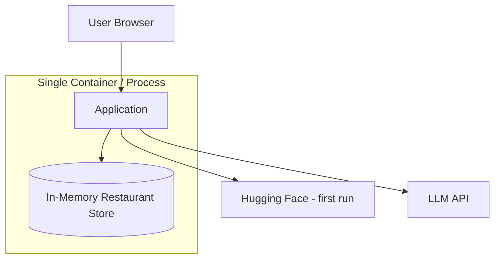

# Architecture: AI-Powered Restaurant Recommendation System

> Derived from [`context.md`](context.md) and [`Docs/ProblemStatement.txt`](Docs/ProblemStatement.txt).

## 1. Purpose

This document describes the technical architecture for a Zomato-inspired restaurant recommendation service. The system combines **deterministic filtering** over structured restaurant data with **LLM-based reasoning** to produce ranked, explainable recommendations tailored to user preferences.

### 1.1 Design Goals

| Goal | Description |
|------|-------------|
| **Grounded recommendations** | Every suggestion must map to a real record from the Zomato Hugging Face dataset |
| **Personalization** | LLM ranks and explains choices using user-specific preferences |
| **Separation of concerns** | Data pipeline, filtering, LLM orchestration, and presentation are isolated modules |
| **Extensibility** | New filters, preference types, or LLM providers can be swapped without rewriting the core |
| **Clarity** | Output is scannable (facts from data) plus narrative (AI explanation) |

### 1.2 Non-Goals (Initial Version)

- Real-time restaurant availability or live Zomato API integration
- User accounts, authentication, or persistent preference history
- Geospatial routing or map-based discovery
- Training or fine-tuning custom ML models on the dataset

---

## 2. System Context



**External actors**

- **User** — provides location, budget, cuisine, minimum rating, and optional free-text preferences
- **Hugging Face** — hosts `ManikaSaini/zomato-restaurant-recommendation`
- **LLM provider** — OpenAI, Anthropic, Google, or local model via a unified client abstraction

---

## 3. High-Level Architecture

The application follows a **layered, pipeline-oriented** design: structured data narrows the candidate set; the LLM operates only on that bounded, validated context.



### 3.1 Architectural Style

- **Hybrid retrieval + generation**: filter-first (SQL/DataFrame-style), then generate (LLM)
- **Single deployable unit** for MVP (monolith with clear module boundaries)
- **Optional async** for LLM calls if latency becomes an issue

---

## 4. Layer Breakdown

### 4.1 Presentation Layer

**Responsibility:** Collect user preferences and render recommendation cards.

| Component | Role |
|-----------|------|
| **Preference form** | Location, budget tier, cuisine, min rating, optional tags / free text |
| **Results view** | Cards showing name, cuisine, rating, cost, AI explanation |
| **Loading / error states** | Handle LLM latency and failures gracefully |

**Suggested implementations**

- **MVP:** Streamlit or Gradio for rapid prototyping
- **Production-oriented:** React/Next.js or Vue SPA calling a REST API

**Output contract (per restaurant)**

```json
{
  "restaurant_id": "string",
  "name": "string",
  "cuisine": "string",
  "rating": 4.2,
  "estimated_cost": "₹500 for two",
  "location": "Bangalore",
  "rank": 1,
  "explanation": "Great fit for your medium budget and Italian preference..."
}
```

### 4.2 Application Layer

**Responsibility:** HTTP/API boundaries, request validation, orchestration entry point.

| Endpoint (example) | Method | Description |
|----------------------|--------|-------------|
| `/health` | GET | Liveness check |
| `/recommendations` | POST | Accept preferences, return ranked list |
| `/dataset/stats` | GET | Optional: city/cuisine counts for UI hints |

**Request body (example)**

```json
{
  "location": "Bangalore",
  "budget": "medium",
  "cuisine": "Italian",
  "min_rating": 4.0,
  "additional_preferences": ["family-friendly", "quick service"],
  "top_k": 5
}
```

**Validation rules**

- `location` — required, non-empty; normalized against known cities in dataset
- `budget` — enum: `low` | `medium` | `high`
- `cuisine` — string; fuzzy match against dataset cuisine values
- `min_rating` — float in `[0, 5]`
- `top_k` — integer, default 5, max 10 (limits LLM context size)

### 4.3 Domain Layer

Core business logic. No direct UI or HTTP dependencies.

#### 4.3.1 Data Ingestion Module

| Step | Action |
|------|--------|
| 1 | Download/load dataset via `datasets` (Hugging Face) |
| 2 | Select and rename columns to canonical schema |
| 3 | Clean nulls, normalize location/cuisine strings |
| 4 | Map raw cost fields to budget tiers (`low` / `medium` / `high`) |
| 5 | Persist normalized records to in-memory store or Parquet cache |

**Canonical restaurant schema**

| Field | Type | Notes |
|-------|------|-------|
| `id` | string | Stable identifier (generated if missing) |
| `name` | string | Restaurant name |
| `location` | string | City / area |
| `cuisine` | string | Primary or comma-separated cuisines |
| `rating` | float | Normalized 0–5 |
| `cost_for_two` | number | Raw numeric cost where available |
| `budget_tier` | enum | Derived: low / medium / high |
| `metadata` | object | Optional: votes, address, rest type, etc. |

#### 4.3.2 Filter Service

Applies **deterministic predicates** before any LLM call.

```
candidates = all_restaurants
  .where(location matches user.location)
  .where(rating >= user.min_rating)
  .where(cuisine matches user.cuisine)      // exact or contains
  .where(budget_tier matches user.budget)
  .limit(MAX_CANDIDATES)                    // e.g. 20–50 for prompt budget
```

| Filter | Strategy |
|--------|----------|
| Location | Case-insensitive equality or substring on city |
| Rating | `rating >= min_rating` |
| Cuisine | Token match on cuisine field |
| Budget | Map user tier to cost ranges derived from dataset percentiles |
| Additional prefs | Keyword match on metadata OR deferred to LLM in prompt |

If **zero candidates** after hard filters, return a user-facing message suggesting relaxed criteria (do not call LLM).

#### 4.3.3 Prompt Builder

Constructs a **structured, bounded** prompt:

1. **System message** — role, constraints (only recommend from provided list; output JSON)
2. **User context** — serialized preferences
3. **Candidate list** — compact JSON array (id, name, cuisine, rating, cost, location)
4. **Instructions** — rank top N, explain each, optional one-line summary

**Prompt design principles**

- Include explicit instruction: *"Do not invent restaurants not in the list."*
- Request structured JSON for reliable parsing
- Cap candidate count to control tokens and cost
- Include ranking criteria order: rating, budget fit, cuisine match, additional prefs

#### 4.3.4 Recommendation Orchestrator

Coordinates filter → prompt → LLM → parse → enrich.



#### 4.3.5 LLM Response Parser

- Parse JSON from model output (handle markdown code fences)
- Validate each `restaurant_id` exists in candidate set
- Drop or flag hallucinated entries
- Merge LLM `explanation` and `rank` with authoritative fields from repository

### 4.4 Data Layer

| Component | Description |
|-----------|-------------|
| **RestaurantRepository** | CRUD-read interface over normalized restaurants |
| **DatasetLoader** | One-time or scheduled load from Hugging Face |
| **Cache** | In-memory DataFrame (MVP) or Parquet on disk for faster restarts |

**Dataset source**

- URL: https://huggingface.co/datasets/ManikaSaini/zomato-restaurant-recommendation
- Load via `datasets.load_dataset(...)` at application startup or via CLI ingest command

---

## 5. Data Flow (End-to-End)



### 5.1 Budget Tier Mapping (Example)

Derived once during ingestion from `cost_for_two` distribution:

| Tier | Percentile (example) |
|------|----------------------|
| low | 0–33rd |
| medium | 33rd–66th |
| high | 66th–100th |

Thresholds are **data-driven**, not hard-coded rupee values, so they adapt to the dataset.

---

## 6. LLM Integration

### 6.1 Provider Abstraction

```text
LLMClient (interface)
  ├── complete(messages, temperature, max_tokens) -> str
  ├── OpenAIClient
  ├── AnthropicClient
  └── LocalClient (optional: Ollama)
```

Configuration via environment variables: `LLM_PROVIDER`, `LLM_API_KEY`, `LLM_MODEL`.

### 6.2 Expected LLM Output Schema

```json
{
  "summary": "Here are 3 Italian spots in Bangalore that match your budget and rating bar.",
  "recommendations": [
    {
      "restaurant_id": "abc123",
      "rank": 1,
      "explanation": "Highest rating in your range with mid-range pricing."
    }
  ]
}
```

### 6.3 Failure Modes & Fallbacks

| Failure | Handling |
|---------|----------|
| LLM timeout | Retry once; fallback to rating-sorted top K from filtered list |
| Invalid JSON | Retry with repair prompt; else fallback sort |
| Hallucinated ID | Strip entry; backfill from next valid ranked item |
| Rate limit | Exponential backoff; surface friendly error to user |

### 6.4 Cost & Latency Controls

- Limit candidates sent to LLM (e.g. max 30)
- Use smaller/faster model for MVP
- Cache identical preference queries (optional, short TTL)

---

## 7. Module Structure (Suggested)

```text
zomato-ai/
├── app/
│   ├── main.py                 # Entry (FastAPI / Streamlit)
│   ├── api/
│   │   └── routes.py           # HTTP endpoints
│   ├── domain/
│   │   ├── models.py           # UserPreferences, Restaurant, Recommendation
│   │   ├── filter.py           # FilterService
│   │   ├── orchestrator.py     # RecommendationOrchestrator
│   │   └── prompt.py           # PromptBuilder
│   ├── data/
│   │   ├── loader.py           # Hugging Face ingestion
│   │   ├── preprocessor.py     # Cleaning, budget tiers
│   │   └── repository.py       # RestaurantRepository
│   ├── llm/
│   │   ├── client.py           # Provider abstraction
│   │   └── parser.py           # Response parsing & validation
│   └── ui/                     # Optional: Streamlit components
├── config/
│   └── settings.py             # Env-based configuration
├── tests/
│   ├── test_filter.py
│   ├── test_prompt.py
│   └── test_parser.py
├── context.md
├── architecture.md
└── requirements.txt
```

---

## 8. Technology Stack (Recommended)

| Layer | Option A (MVP) | Option B (Production) |
|-------|----------------|-------------------------|
| Language | Python 3.11+ | Python 3.11+ |
| Data | `pandas`, `datasets` | Same + Parquet cache |
| API | FastAPI | FastAPI + Uvicorn |
| UI | Streamlit | React + REST |
| LLM | OpenAI API | Pluggable via `LLMClient` |
| Config | `pydantic-settings`, `.env` | Same |
| Testing | `pytest` | `pytest` + contract tests for prompts |

---

## 9. Cross-Cutting Concerns

### 9.1 Configuration

| Variable | Purpose |
|----------|---------|
| `HF_DATASET_NAME` | Hugging Face dataset id |
| `LLM_API_KEY` | Provider authentication |
| `LLM_MODEL` | Model name |
| `MAX_CANDIDATES` | Filter cap before LLM |
| `DEFAULT_TOP_K` | Number of recommendations returned |

### 9.2 Logging & Observability

- Log filter counts (input size → candidate size)
- Log LLM latency and token usage (if provider exposes)
- Never log full API keys or raw PII

### 9.3 Security

- API keys only in environment / secrets manager
- Validate and sanitize all user inputs
- No arbitrary code execution from user free-text preferences

### 9.4 Testing Strategy

| Layer | Test type |
|-------|-----------|
| Preprocessor | Unit: null handling, budget tier assignment |
| Filter | Unit: edge cases (no match, partial cuisine) |
| Prompt | Snapshot: prompt structure for fixed inputs |
| Parser | Unit: malformed JSON, invalid IDs |
| E2E | Integration: mock LLM returns fixed JSON → UI payload |

---

## 10. Deployment View (MVP)



**Bootstrap sequence**

1. Start application
2. Load or refresh dataset from Hugging Face (or cached Parquet)
3. Serve requests

For serverless or cold-start scenarios, pre-build Parquet at build time and bundle with the image.

---

## 11. Evolution Path

| Phase | Enhancement |
|-------|-------------|
| v1 | Monolith, in-memory data, single LLM provider |
| v1.1 | Persistent cache, configurable budget percentiles |
| v2 | Vector search for `additional_preferences` (semantic match) |
| v2.1 | User sessions and saved preferences |
| v3 | Separate recommendation microservice, queue-based LLM calls |

---

## 12. Success Criteria (Architecture Alignment)

From [`context.md`](context.md):

- [ ] Preferences flow through validation → filter → LLM → grounded output
- [ ] All displayed restaurants exist in the Hugging Face dataset
- [ ] LLM provides rank, per-item explanation, and optional summary
- [ ] UI shows name, cuisine, rating, cost, and AI explanation
- [ ] System degrades gracefully when LLM or filters return no results

---

## 13. Related Documents

| Document | Purpose |
|----------|---------|
| [`context.md`](context.md) | Project summary, workflow, success criteria |
| [`Docs/ProblemStatement.txt`](Docs/ProblemStatement.txt) | Original problem statement |
