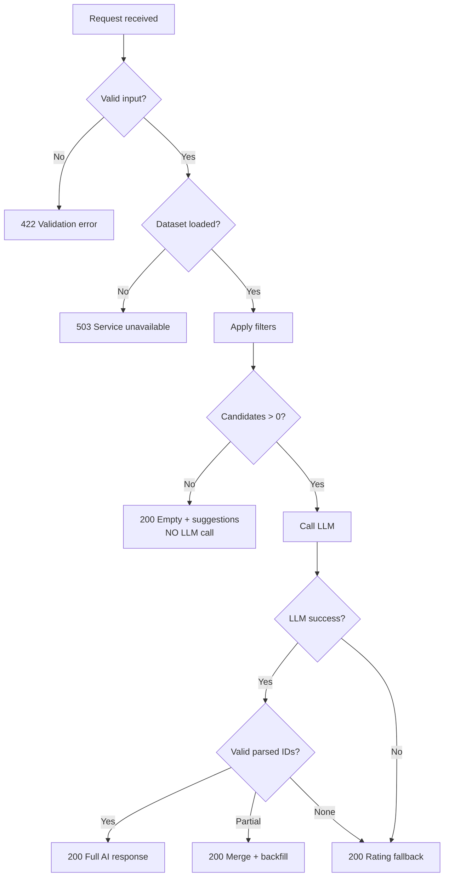

# Edge Cases & Handling Guide

> AI-Powered Restaurant Recommendation System  
> Companion to [`context.md`](context.md), [`architecture.md`](architecture.md), and [`implementation-plan.md`](implementation-plan.md).

This document catalogs edge cases across the full pipeline, defines expected system behavior for each, and maps handling to the responsible layer. Use it during implementation, QA, and code review.

---

## How to Use This Document

| Column | Meaning |
|--------|---------|
| **ID** | Unique reference (e.g. `DATA-01`) for tests and issues |
| **Severity** | `Critical` — data integrity / security; `High` — broken UX; `Medium` — degraded experience; `Low` — cosmetic or rare |
| **Layer** | Where handling must occur |
| **Behavior** | What the system should do |
| **User message** | Copy shown in UI (when applicable) |

**Severity legend:** Critical > High > Medium > Low

---

## 1. Data Ingestion & Preprocessing

### 1.1 Dataset Load & Schema

| ID | Edge case | Severity | Behavior | User / system impact |
|----|-----------|----------|----------|----------------------|
| DATA-01 | Hugging Face unreachable (network, timeout) | High | Retry 3× with exponential backoff; if cache exists, load Parquet; else fail startup with clear log | App does not serve `/recommendations` until data loaded; `/health` returns `degraded` |
| DATA-02 | Dataset schema changed (missing/renamed columns) | Critical | Log column diff; map known aliases; fail ingest if required fields (`name`, `location`) missing | Block startup; document required column mapping in logs |
| DATA-03 | Empty dataset returned | Critical | Abort ingest; raise `DatasetEmptyError` | No recommendations possible |
| DATA-04 | Duplicate rows (same name + location) | Medium | Deduplicate on ingest; keep row with highest rating or first occurrence | Prevents duplicate cards |
| DATA-05 | Split/load only partial data (corrupt download) | High | Validate row count > threshold; checksum optional | Re-download or use cache |

### 1.2 Field-Level Data Quality

| ID | Edge case | Severity | Behavior |
|----|-----------|----------|----------|
| DATA-06 | `name` is null or empty | High | Drop row; increment `dropped_rows` counter in logs |
| DATA-07 | `location` is null or empty | High | Drop row (cannot filter by city) |
| DATA-08 | `rating` is null | Medium | Default to `0.0` or drop if policy is strict; document choice |
| DATA-09 | `rating` out of range (e.g. 8.5, negative) | Medium | Clamp to `[0, 5]` or drop row if clearly invalid |
| DATA-10 | `rating` stored as string (`"4.5/5"`, `"New"`) | Medium | Parse numeric portion; treat `"New"` / non-numeric as `null` → default |
| DATA-11 | `cost_for_two` missing | Medium | Set `cost_for_two = null`; assign `budget_tier` via city/cuisine median or `"unknown"` tier excluded from budget filter |
| DATA-12 | `cost_for_two` non-numeric (`"₹1,200 for two"`, `"300-500"`) | Medium | Extract first number or midpoint of range; log unparseable as null |
| DATA-13 | `cost_for_two` is zero or negative | Low | Treat as null; exclude from percentile calculation |
| DATA-14 | `cuisine` null or empty | Medium | Set `cuisine = "Unknown"`; cuisine filter may exclude unless user selects "Any" |
| DATA-15 | Multi-cuisine string (`"North Indian, Chinese, Mughlai"`) | Low | Keep full string; filter uses token/substring match |
| DATA-16 | Location aliases (`"Bengaluru"` vs `"Bangalore"`) | Medium | Maintain alias map at ingest: normalize to canonical city name |
| DATA-17 | Extra whitespace / mixed case in text fields | Low | `strip()` + title case for display; lowercase for matching |
| DATA-18 | Very long restaurant name or address | Low | Truncate in LLM prompt only (e.g. 200 chars); full name in UI from repository |
| DATA-19 | Special characters / Unicode in names | Low | Preserve UTF-8; no stripping of valid scripts |
| DATA-20 | `metadata` contains nested or malformed JSON | Low | Store as string dict; skip fields that fail parse |

### 1.3 Budget Tier Derivation

| ID | Edge case | Severity | Behavior |
|----|-----------|----------|----------|
| DATA-21 | Fewer than 10 rows with valid `cost_for_two` | Medium | Use global percentiles; log warning |
| DATA-22 | All costs identical | Low | Assign all to `medium` tier |
| DATA-23 | Single city has no cost data | Medium | Fall back to global percentiles for that city's rows |
| DATA-24 | User budget tier has zero restaurants in city | High | See FILTER-08; suggest different budget |

### 1.4 Cache & Persistence

| ID | Edge case | Severity | Behavior |
|----|-----------|----------|----------|
| DATA-25 | Parquet cache missing on startup | Medium | Trigger full Hugging Face ingest |
| DATA-26 | Parquet cache corrupted | High | Delete cache file; re-ingest from source |
| DATA-27 | Cache stale (dataset updated upstream) | Low | `FORCE_REFRESH_DATASET=true` bypasses cache |
| DATA-28 | Disk full while writing cache | Medium | Log error; run in-memory only for session |

---

## 2. User Input & Validation

### 2.1 Required Fields

| ID | Edge case | Severity | Behavior | HTTP | User message |
|----|-----------|----------|----------|------|--------------|
| INPUT-01 | Missing `location` | High | Reject request | 422 | "Location is required." |
| INPUT-02 | Empty string `location` (`""`, `"   "`) | High | Reject after trim | 422 | "Please enter a valid city." |
| INPUT-03 | Missing `budget` | High | Reject | 422 | "Please select a budget (low, medium, or high)." |
| INPUT-04 | Invalid `budget` value (`"cheap"`, `123`) | High | Reject | 422 | "Budget must be low, medium, or high." |
| INPUT-05 | Missing `cuisine` | Medium | Default to `"Any"` or reject — **pick one and document** | 422 or proceed | If default: no cuisine filter applied |

### 2.2 Optional & Numeric Fields

| ID | Edge case | Severity | Behavior | HTTP | User message |
|----|-----------|----------|----------|------|--------------|
| INPUT-06 | `min_rating` omitted | Low | Default to `0.0` | 200 | — |
| INPUT-07 | `min_rating` < 0 or > 5 | High | Reject | 422 | "Rating must be between 0 and 5." |
| INPUT-08 | `min_rating` non-numeric (`"four"`) | High | Reject | 422 | "Rating must be a number." |
| INPUT-09 | `top_k` omitted | Low | Default to `5` (`DEFAULT_TOP_K`) | 200 | — |
| INPUT-10 | `top_k` < 1 | High | Reject | 422 | "Please request at least 1 recommendation." |
| INPUT-11 | `top_k` > 10 | High | Clamp to `10` or reject — **prefer clamp** | 200 | — |
| INPUT-12 | `top_k` float (`3.7`) | Medium | Truncate to int `3` | 200 | — |

### 2.3 Location & Cuisine Strings

| ID | Edge case | Severity | Behavior | User message |
|----|-----------|----------|----------|--------------|
| INPUT-13 | Location not in dataset (e.g. `"Tokyo"`) | High | Return empty results + suggestions | "No restaurants found in Tokyo. Try: Delhi, Bangalore, …" |
| INPUT-14 | Location close match (`"Banglore"` typo) | Medium | Fuzzy match to nearest city if confidence > threshold; else treat as unknown | "Did you mean Bangalore?" (optional) |
| INPUT-15 | Case variation (`"delhi"`, `"DELHI"`) | Low | Normalize before filter | — |
| INPUT-16 | Cuisine not in dataset (`"Mexican"`) | High | Empty filter result | "No Mexican restaurants found in {city}. Try another cuisine." |
| INPUT-17 | Cuisine `"Any"` / `"all"` / empty | Low | Skip cuisine filter | — |
| INPUT-18 | Partial cuisine (`"Ital"`) | Medium | Prefix/substring match if ≥3 chars; else exact match only | — |

### 2.4 Additional Preferences

| ID | Edge case | Severity | Behavior |
|----|-----------|----------|----------|
| INPUT-19 | `additional_preferences` empty array | Low | Omit from prompt emphasis |
| INPUT-20 | Very long free-text preference (>500 chars) | Medium | Truncate to 500 chars; log warning |
| INPUT-21 | Prompt injection in additional prefs (`"Ignore instructions…"`) | Critical | Sanitize: strip control chars; pass as quoted user preference only; system prompt forbids overriding rules |
| INPUT-22 | HTML/script in input (`<script>…`) | High | Escape or strip tags; never render as HTML in UI without sanitization |
| INPUT-23 | Duplicate tags in array | Low | Deduplicate case-insensitively |
| INPUT-24 | Contradictory prefs (`"cheap"` + budget `high`) | Low | LLM may note conflict; filters use structured fields only |

### 2.5 API / Payload

| ID | Edge case | Severity | Behavior | HTTP |
|----|-----------|----------|----------|------|
| INPUT-25 | Malformed JSON body | High | Reject | 400 |
| INPUT-26 | Wrong Content-Type | Medium | Reject or attempt parse | 415 / 400 |
| INPUT-27 | Extra unknown fields in body | Low | Ignore (Pydantic `extra = ignore`) | 200 |
| INPUT-28 | Null body | High | Reject | 400 |

---

## 3. Filter Service

### 3.1 Zero & Sparse Results

| ID | Edge case | Severity | Behavior | User message |
|----|-----------|----------|----------|--------------|
| FILTER-01 | Zero candidates after all filters | High | **Do not call LLM**; return `recommendations: []`, `suggestions` array | "No restaurants match your criteria. Try lowering minimum rating or choosing a different cuisine." |
| FILTER-02 | Only 1 candidate | Medium | Proceed to LLM with 1 item; `top_k` effectively 1 | — |
| FILTER-03 | Candidates < `top_k` | Low | Return all matches; LLM ranks available set | "Showing all {n} matches." |
| FILTER-04 | Candidates > `MAX_CANDIDATES` | Medium | Take top N by rating (pre-LLM sort); pass capped list to LLM | — |

### 3.2 Per-Filter Edge Cases

| ID | Edge case | Severity | Behavior |
|----|-----------|----------|----------|
| FILTER-05 | `min_rating = 5.0` (very strict) | Medium | May return few/zero results; include in empty-state suggestions |
| FILTER-06 | Budget filter excludes all (no rows in tier) | High | Empty result; suggest adjacent tier |
| FILTER-07 | Cuisine multi-match ambiguity (`"Indian"` matches many) | Low | Return all matches; let LLM rank |
| FILTER-08 | Location matches suburb vs city inconsistently | Medium | Document matching rule: city-level equality preferred; substring fallback |
| FILTER-09 | Restaurant has `budget_tier = unknown` | Medium | Exclude from budget filter OR include in all tiers — **document policy** |
| FILTER-10 | Filter order dependency | Low | Apply location → rating → cuisine → budget (consistent order) |

### 3.3 Relaxation Strategy (Optional Enhancement)

| ID | Edge case | Severity | Behavior |
|----|-----------|----------|----------|
| FILTER-11 | User wants automatic relaxation | Low | If zero results: retry without cuisine, then without budget, then lower rating by 0.5; cap 3 retries; log each step |
| FILTER-12 | Relaxation still yields zero | High | Return empty with full suggestion list | See FILTER-01 |

---

## 4. LLM Integration

### 4.1 Provider & Connectivity

| ID | Edge case | Severity | Behavior | User message |
|----|-----------|----------|----------|--------------|
| LLM-01 | Missing `LLM_API_KEY` | Critical | Fail at startup (strict) or fallback-only mode (lenient) | "Recommendation service is temporarily unavailable." |
| LLM-02 | Invalid API key | High | Log error; no retry; fallback to rating sort | "AI recommendations unavailable. Showing top-rated matches." |
| LLM-03 | Request timeout | High | Retry once (2s backoff); then fallback | Same as LLM-02 |
| LLM-04 | Rate limit (429) | High | Exponential backoff max 3 attempts; then fallback | "High demand — showing rated picks while AI catches up." |
| LLM-05 | Provider 5xx errors | High | Retry once; fallback | Same as LLM-02 |
| LLM-06 | Model not found / deprecated | High | Log config error; fail fast at startup | Admin-facing error in logs |
| LLM-07 | Token limit exceeded (prompt too large) | Medium | Reduce candidate count in prompt; retry with fewer candidates | — |
| LLM-08 | Empty response from model | High | Fallback to rating-sorted list | LLM-02 message |
| LLM-09 | Response truncated mid-JSON | High | Repair prompt once; else fallback | — |

### 4.2 Prompt Construction

| ID | Edge case | Severity | Behavior |
|----|-----------|----------|----------|
| LLM-10 | Zero candidates passed to prompt builder | Critical | **Must not call LLM** — assert in orchestrator |
| LLM-11 | Candidate with null fields in prompt | Medium | Omit null keys or use `"N/A"` in compact JSON |
| LLM-12 | Identical candidates (duplicates after filter) | Low | Deduplicate by `id` before prompt |
| LLM-13 | Extremely large candidate metadata | Medium | Send only: id, name, cuisine, rating, cost, location |
| LLM-14 | User prefs contain non-ASCII / emoji | Low | Include as-is in UTF-8 prompt |
| LLM-15 | `top_k` > candidate count | Low | Instruct LLM to rank all available |

### 4.3 Model Output Quality

| ID | Edge case | Severity | Behavior |
|----|-----------|----------|----------|
| LLM-16 | Model invents restaurant not in list | Critical | Parser drops invalid IDs; log `hallucination_count` |
| LLM-17 | Model returns fewer than `top_k` items | Medium | Backfill from rating-sorted candidates not yet shown |
| LLM-18 | Model returns duplicate IDs | Medium | Keep first occurrence by rank |
| LLM-19 | Duplicate ranks (two `rank: 1`) | Low | Re-number sequentially by array order |
| LLM-20 | Missing `explanation` for item | Low | Default: "Matches your preferences based on rating and cuisine." |
| LLM-21 | Missing `summary` | Low | Omit or generate: "Top picks in {city} for {cuisine}." |
| LLM-22 | Explanation contradicts data (wrong rating cited) | Medium | Display dataset facts from repository; treat explanation as narrative only |
| LLM-23 | Offensive / inappropriate explanation | Medium | Optional content filter; replace with generic explanation |
| LLM-24 | Non-JSON response (prose only) | High | Repair prompt; fallback |
| LLM-25 | JSON wrapped in markdown fences | Low | Strip ` ```json ` before parse |
| LLM-26 | JSON with trailing commas / minor syntax errors | Medium | Use lenient parser or repair; fallback if fails |
| LLM-27 | Wrong types (`rank` as string `"1"`) | Low | Coerce to int where possible |

---

## 5. Response Parser & Orchestrator

| ID | Edge case | Severity | Behavior |
|----|-----------|----------|----------|
| PARSE-01 | `restaurant_id` not in candidate set | Critical | Drop entry; log warning |
| PARSE-02 | Valid ID but restaurant deleted from repo mid-request | Low | Skip (unlikely in MVP) |
| PARSE-03 | All parsed IDs invalid (100% hallucination) | High | Full fallback to rating sort |
| PARSE-04 | Partial valid IDs (< `top_k`) | Medium | Backfill from remaining candidates by rating |
| PARSE-05 | Merge: repository missing `cost_for_two` | Low | Display `"Price not available"` |
| PARSE-06 | Merge: rating display formatting | Low | Show 1 decimal; handle `0.0` as "Unrated" if policy |
| PARSE-07 | Orchestrator called before dataset loaded | Critical | Return 503 | "Service starting up. Please try again." |
| PARSE-08 | Concurrent requests during ingest | Medium | Block requests until load complete or return 503 |
| PARSE-09 | Same request fired twice rapidly | Low | Optional idempotent cache by preference hash |

---

## 6. API Layer

| ID | Edge case | Severity | Behavior | HTTP |
|----|-----------|----------|----------|------|
| API-01 | `GET /health` before data load | Medium | `{ "status": "starting" }` | 503 |
| API-02 | `GET /health` after load | Low | `{ "status": "ok", "restaurant_count": N }` | 200 |
| API-03 | `POST /recommendations` during ingest | High | 503 | "Service unavailable." |
| API-04 | Request body too large (>1MB) | Medium | 413 | "Request too large." |
| API-05 | Unsupported HTTP method on route | Low | 405 | — |
| API-06 | Internal unhandled exception | High | 500; log stack trace; generic message | "Something went wrong. Please try again." |
| API-07 | `GET /dataset/stats` with empty repo | Medium | Return zeros / empty lists | 200 |

---

## 7. User Interface

| ID | Edge case | Severity | Behavior | User message |
|----|-----------|----------|----------|--------------|
| UI-01 | User submits before required fields filled | High | Disable submit or inline validation | Field-level hints |
| UI-02 | LLM takes >10s | Medium | Show spinner; optional cancel | "Finding the best spots for you…" |
| UI-03 | API returns 500 | High | Error banner; no partial fake data | "Could not load recommendations." |
| UI-04 | Empty recommendations array | High | Empty state component + suggestions | FILTER-01 message |
| UI-05 | Very long explanation text | Low | Truncate with "Read more" expand | — |
| UI-06 | Missing image URL (if added later) | Low | Placeholder icon | — |
| UI-07 | Browser back after submit | Low | Re-render last results from session state | — |
| UI-08 | Mobile narrow viewport | Low | Stack cards vertically | — |
| UI-09 | Streamlit rerun double-submit | Medium | Debounce submit button | — |

---

## 8. Configuration, Deployment & Runtime

| ID | Edge case | Severity | Behavior |
|----|-----------|----------|----------|
| OPS-01 | `.env` missing | High | Fail startup with list of required vars |
| OPS-02 | Invalid `MAX_CANDIDATES` (negative, string) | Medium | Fall back to default `30` |
| OPS-03 | Cold start without cache (slow) | Medium | Show loading in UI; extend health check timeout |
| OPS-04 | Out of memory loading full dataset | High | Use chunked ingest; or filter columns early |
| OPS-05 | Docker container missing HF access | High | Bundle Parquet in image at build time |
| OPS-06 | Clock skew affecting cache TTL | Low | Use file mtime not wall clock for cache validity |
| OPS-07 | Process killed mid-ingest | Medium | Write cache atomically (temp file + rename) |

---

## 9. Security

| ID | Edge case | Severity | Behavior |
|----|-----------|----------|----------|
| SEC-01 | API key in logs | Critical | Never log `LLM_API_KEY`; redact in error messages |
| SEC-02 | API key committed to git | Critical | Use `.env`; document in README |
| SEC-03 | Prompt injection via user fields | Critical | See INPUT-21; hardened system prompt |
| SEC-04 | SQL injection | N/A | No raw SQL in MVP; pandas filters only |
| SEC-05 | DoS via huge `top_k` or spam requests | Medium | Rate limit per IP (production); clamp `top_k` |
| SEC-06 | Path traversal in cache path | Medium | Fixed cache directory; no user-controlled paths |

---

## 10. Decision Matrix: Empty vs Fallback vs Error



| Situation | HTTP | Call LLM? | Response type |
|-----------|------|-----------|---------------|
| Invalid input | 422 | No | Error detail |
| Dataset not ready | 503 | No | Error message |
| Zero filter matches | 200 | **No** | Empty + suggestions |
| LLM failure | 200 | Yes (failed) | Fallback ranking + notice |
| Partial LLM parse | 200 | Yes | Merged + backfill |
| Full success | 200 | Yes | Ranked + explanations |

---

## 11. Standard Response Shapes

### 11.1 Empty Filter Result

```json
{
  "summary": null,
  "recommendations": [],
  "meta": {
    "source": "filter",
    "candidate_count": 0,
    "llm_used": false
  },
  "suggestions": [
    "Lower minimum rating by 0.5",
    "Try a different cuisine",
    "Switch budget to medium"
  ],
  "message": "No restaurants match your criteria in Bangalore."
}
```

### 11.2 LLM Fallback Result

```json
{
  "summary": "Showing top-rated matches (AI unavailable).",
  "recommendations": [ "... rating-sorted, generic explanation ..." ],
  "meta": {
    "source": "fallback",
    "candidate_count": 12,
    "llm_used": false,
    "fallback_reason": "timeout"
  }
}
```

### 11.3 Validation Error

```json
{
  "detail": [
    {
      "loc": ["body", "min_rating"],
      "msg": "Rating must be between 0 and 5",
      "type": "value_error"
    }
  ]
}
```

---

## 12. Test Case Mapping

Map edge-case IDs to test files (from [`implementation-plan.md`](implementation-plan.md) Phase 6):

| Test file | Edge-case IDs |
|-----------|---------------|
| `tests/test_preprocessor.py` | DATA-06 – DATA-24 |
| `tests/test_filter.py` | FILTER-01 – FILTER-12 |
| `tests/test_prompt.py` | LLM-10 – LLM-15 |
| `tests/test_parser.py` | LLM-16 – LLM-27, PARSE-01 – PARSE-06 |
| `tests/test_api.py` | INPUT-01 – INPUT-28, API-01 – API-07 |
| `tests/test_integration.py` | LLM-03 – LLM-09, PARSE-03 – PARSE-04, end-to-end |

### Priority for MVP

| Priority | IDs | Rationale |
|----------|-----|-----------|
| P0 | DATA-01–03, INPUT-01–04, FILTER-01, LLM-10, LLM-16, PARSE-01, PARSE-03, SEC-01–03 | Core correctness and safety |
| P1 | DATA-06–15, INPUT-06–17, FILTER-04–06, LLM-03–09, LLM-24–26 | Common real-world data issues |
| P2 | Remaining IDs | Polish, ops, UI |

---

## 13. Implementation Policies (Resolve Once)

These edge cases require a **single team decision** — document the chosen policy in code comments:

| Topic | Options | Recommended default |
|-------|---------|---------------------|
| Missing `cuisine` in request | Reject vs default `"Any"` | Default `"Any"` (skip filter) |
| Missing `cost` / budget tier unknown | Exclude vs include in all budgets | Exclude from strict budget match |
| `top_k` > 10 | Reject vs clamp | Clamp to 10 |
| Location typo | Strict fail vs fuzzy match | Fuzzy match if Levenshtein ≤ 2 |
| LLM unavailable at startup | Fail vs fallback-only | Fail if API key required for demo |
| Automatic filter relaxation | On vs off | Off for MVP; empty state only |

---

## 14. Related Documents

| Document | Relevance |
|----------|-----------|
| [`architecture.md`](architecture.md) | §6.3 Failure modes, validation rules |
| [`implementation-plan.md`](implementation-plan.md) | Phase tasks, risk register |
| [`context.md`](context.md) | Success criteria driving UX messages |
