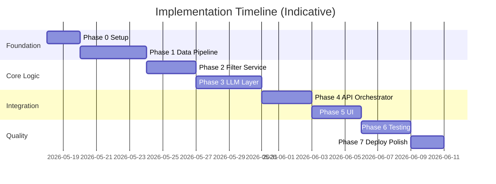

# Phase-Wise Implementation Plan

> AI-Powered Restaurant Recommendation System (Zomato Use Case)  
> Based on [`context.md`](context.md) and [`architecture.md`](architecture.md).

## Executive Summary

This plan delivers the full system in **seven phases**, from project scaffolding through production-ready MVP. Each phase has clear deliverables, tasks, dependencies, and acceptance criteria aligned with the hybrid **filter-first + LLM** architecture.

**Estimated total:** ~3–4 weeks (solo developer, part-time adjust accordingly).

---

## Phase Overview

| Phase | Name | Primary outcome | Depends on |
|-------|------|-----------------|------------|
| **0** | Project setup | Runnable repo, config, dependencies | — |
| **1** | Data pipeline | Normalized restaurants in repository | Phase 0 |
| **2** | Filter service | Deterministic candidate retrieval | Phase 1 |
| **3** | LLM layer | Prompt, client, parser working in isolation | Phase 2 |
| **4** | API & orchestrator | End-to-end recommendation via API | Phase 3 |
| **5** | User interface | Preference form + result cards | Phase 4 |
| **6** | Testing & hardening | Tests, fallbacks, observability | Phase 5 |
| **7** | Deployment & polish | Cached data, docs, deployable MVP | Phase 6 |

---

## Phase 0: Project Setup & Foundation

### Goal

Establish repository structure, dependencies, configuration, and development conventions so later phases plug into a consistent layout.

### Deliverables

- [x] Python project with `requirements.txt` (or `pyproject.toml`)
- [x] Folder structure per [`architecture.md` §7](architecture.md)
- [x] `.env.example` with documented variables
- [x] `config/settings.py` using `pydantic-settings`
- [x] Basic README with setup instructions
- [x] `.gitignore` (venv, `.env`, `__pycache__`, `data/cache/`)

### Tasks

| # | Task | Notes |
|---|------|-------|
| 0.1 | Initialize repo and virtual environment | Python 3.11+ |
| 0.2 | Add core dependencies | `pandas`, `datasets`, `pydantic`, `pydantic-settings`, `python-dotenv` |
| 0.3 | Create `app/domain/models.py` | `UserPreferences`, `Restaurant`, `Recommendation`, `BudgetTier` enums |
| 0.4 | Define environment variables | `HF_DATASET_NAME`, `LLM_API_KEY`, `LLM_MODEL`, `LLM_PROVIDER`, `MAX_CANDIDATES`, `DEFAULT_TOP_K` |
| 0.5 | Add dev dependencies | `pytest`, `httpx` (for API tests later) |
| 0.6 | Optional: pre-commit or formatter config | `ruff` / `black` if desired |

### Acceptance Criteria

- `python -c "from app.config.settings import settings"` runs without error
- All paths in architecture module tree exist (empty modules OK)
- `.env.example` documents every required variable

### Context / Architecture Alignment

- Implements **§7 Module Structure** and **§9.1 Configuration** from architecture
- Sets up domain models referenced in **§4.3** and **context.md** workflow steps 1–2

---

## Phase 1: Data Ingestion & Repository

### Goal

Load the Zomato Hugging Face dataset, preprocess it into the canonical schema, and expose it via `RestaurantRepository`.

### Deliverables

- [x] `app/data/loader.py` — Hugging Face dataset download/load
- [x] `app/data/preprocessor.py` — cleaning, normalization, budget tiers
- [x] `app/data/repository.py` — in-memory read interface
- [x] CLI or script: `python -m app.data.loader` (one-time ingest)
- [x] Unit tests for preprocessor

### Tasks

| # | Task | Details |
|---|------|---------|
| 1.1 | Load dataset | `datasets.load_dataset("ManikaSaini/zomato-restaurant-recommendation")` |
| 1.2 | Inspect raw columns | Map to canonical fields: `id`, `name`, `location`, `cuisine`, `rating`, `cost_for_two`, `budget_tier`, `metadata` |
| 1.3 | Handle missing values | Drop or impute rows missing `name`, `location`; default rating where needed |
| 1.4 | Normalize strings | Lowercase/trim location and cuisine; standardize city names (e.g. "Bangalore" vs "bangalore") |
| 1.5 | Parse `cost_for_two` | Extract numeric cost; handle string formats (₹, ranges) |
| 1.6 | Compute budget tiers | Percentile-based: low (0–33), medium (33–66), high (66–100) per **architecture §5.1** |
| 1.7 | Generate stable `id` | Use existing ID or hash of `name + location` |
| 1.8 | Implement `RestaurantRepository` | `get_all()`, `get_by_id()`, `get_cities()`, `get_cuisines()` |
| 1.9 | Log ingestion stats | Row count, cities, cuisine samples |

### Acceptance Criteria

- Repository returns ≥1 restaurant for a known city in the dataset
- Every record has `budget_tier` ∈ {low, medium, high}
- Preprocessor tests pass for null handling and tier assignment
- Ingestion completes in reasonable time (<5 min on first run)

### Dependencies

- Phase 0 complete
- Network access for Hugging Face on first load

### Context / Architecture Alignment

- **context.md** — System Workflow §1 (Data Ingestion)
- **architecture.md** — §4.3.1, §4.4, canonical schema table

---

## Phase 2: Filter Service & Preference Validation

### Goal

Implement deterministic filtering and input validation so the system returns a bounded candidate set (or a clear empty state) without calling the LLM.

### Deliverables

- [x] `app/domain/filter.py` — `FilterService.apply(preferences) -> list[Restaurant]`
- [x] Preference validation in `app/domain/models.py` or dedicated validator
- [x] Empty-state response model (message + suggestions)
- [x] Unit tests for filter edge cases

### Tasks

| # | Task | Details |
|---|------|---------|
| 2.1 | Validate `UserPreferences` | Location required; budget enum; `min_rating` in [0, 5]; `top_k` default 5, max 10 |
| 2.2 | Location filter | Case-insensitive match on city/location field |
| 2.3 | Rating filter | `rating >= min_rating` |
| 2.4 | Cuisine filter | Token/substring match on cuisine field |
| 2.5 | Budget filter | Match `budget_tier` to user selection |
| 2.6 | Cap candidates | `.limit(MAX_CANDIDATES)` (e.g. 30) before LLM |
| 2.7 | Additional preferences | MVP: pass to prompt only; optional keyword scan in `metadata` |
| 2.8 | Empty result handling | Return structured message: "No restaurants match; try relaxing rating or cuisine" |
| 2.9 | Expose dataset hints | Helper to list valid cities/cuisines for UI dropdowns |

### Acceptance Criteria

- Given Bangalore + Italian + medium + min 4.0, returns only matching records (or empty with message)
- Candidate count never exceeds `MAX_CANDIDATES`
- Filter tests cover: no match, partial cuisine, boundary rating
- No LLM calls in this phase

### Dependencies

- Phase 1 (repository populated)

### Context / Architecture Alignment

- **context.md** — Workflow §2 (User Input), §3 (Integration Layer — filter half)
- **architecture.md** — §4.3.2, validation rules §4.2

---

## Phase 3: LLM Integration (Prompt, Client, Parser)

### Goal

Build the LLM stack in isolation: provider client, prompt builder, response parser, with a mock or real API for manual verification.

### Deliverables

- [x] `app/llm/client.py` — `LLMClient` interface + OpenAI (or chosen provider) implementation
- [x] `app/domain/prompt.py` — `PromptBuilder.build(candidates, preferences) -> messages`
- [x] `app/llm/parser.py` — JSON extraction, ID validation, merge logic
- [x] Sample prompt/response fixtures for tests
- [x] Unit tests for parser; snapshot test for prompt structure

### Tasks

| # | Task | Details |
|---|------|---------|
| 3.1 | Implement `LLMClient.complete()` | Env-based provider selection |
| 3.2 | System prompt | Role + "only recommend from list" + JSON output format |
| 3.3 | User prompt | Serialize preferences + compact candidate JSON |
| 3.4 | Define output schema | `summary` + `recommendations[{restaurant_id, rank, explanation}]` per **architecture §6.2** |
| 3.5 | Parser: extract JSON | Strip markdown fences; handle minor formatting issues |
| 3.6 | Parser: validate IDs | Reject hallucinated IDs; log warnings |
| 3.7 | Parser: merge with repository | Attach authoritative `name`, `cuisine`, `rating`, `estimated_cost`, `location` |
| 3.8 | Manual smoke test | Run prompt + real LLM against 5–10 fixed candidates |
| 3.9 | Document token budget | Keep candidate list ≤30 restaurants |

### Acceptance Criteria

- Parser correctly handles valid JSON, fenced JSON, and malformed input (with defined error path)
- All output `restaurant_id` values exist in input candidate set
- Prompt snapshot test stable for fixed inputs
- Manual run produces rank + explanation for each item

### Dependencies

- Phase 2 (sample candidates for testing)
- Valid `LLM_API_KEY` for integration smoke test

### Context / Architecture Alignment

- **context.md** — Workflow §3 (prompt), §4 (Recommendation Engine)
- **architecture.md** — §4.3.3, §4.3.5, §6

---

## Phase 4: API Layer & Recommendation Orchestrator

### Goal

Wire filter → prompt → LLM → parser into a single orchestrated flow exposed via HTTP API.

### Deliverables

- [x] `app/domain/orchestrator.py` — `RecommendationOrchestrator.recommend(preferences)`
- [x] `app/api/routes.py` — FastAPI routes
- [x] `app/main.py` — app entry, startup dataset load
- [x] Fallback behavior on LLM failure (rating-sorted top K)
- [x] Integration test with mocked LLM

### Tasks

| # | Task | Details |
|---|------|---------|
| 4.1 | Implement orchestrator | Sequence per **architecture §4.3.4** diagram |
| 4.2 | Short-circuit on empty filter | Skip LLM; return empty state |
| 4.3 | `GET /health` | Liveness + dataset loaded flag |
| 4.4 | `POST /recommendations` | Body → validate → orchestrate → response |
| 4.5 | `GET /dataset/stats` | Optional: city/cuisine counts |
| 4.6 | Startup hook | Load repository on app start (from cache or HF) |
| 4.7 | Implement fallbacks | Timeout retry; invalid JSON → rating sort per **§6.3** |
| 4.8 | Structured logging | Log `candidates_in`, `candidates_filtered`, `llm_latency_ms` |
| 4.9 | Response schema | Match output contract in **architecture §4.1** |

### Acceptance Criteria

- `POST /recommendations` with valid prefs returns JSON with `recommendations[]` and optional `summary`
- Empty filter returns 200 with message, not 500
- Mocked LLM integration test passes end-to-end
- Fallback returns rating-sorted list when parser fails

### Dependencies

- Phases 2 and 3 complete

### Context / Architecture Alignment

- **context.md** — Full workflow pipeline
- **architecture.md** — §4.2, §4.3.4, §5 data flow, §6.3 fallbacks

---

## Phase 5: User Interface

### Goal

Deliver a user-friendly interface to collect preferences and display recommendation cards with dataset facts and AI explanations.

### Deliverables

- [x] Streamlit app (MVP) or FastAPI + simple HTML
- [x] Preference form: location, budget, cuisine, min rating, additional prefs, top K
- [x] Results: cards with name, cuisine, rating, cost, explanation
- [x] Loading spinner during LLM call
- [x] Empty and error states

### Tasks

| # | Task | Details |
|---|------|---------|
| 5.1 | Choose UI approach | Streamlit recommended for MVP (**architecture §4.1**) |
| 5.2 | Build preference form | Dropdowns populated from `/dataset/stats` or repository helpers |
| 5.3 | Submit → API call | `POST /recommendations` or direct orchestrator in Streamlit |
| 5.4 | Render recommendation cards | Rank badge, fields, expandable explanation |
| 5.5 | Display summary | Show LLM `summary` above cards if present |
| 5.6 | Loading / error UX | Spinner; friendly message on API/LLM failure |
| 5.7 | Empty state UI | Show filter suggestions when no matches |
| 5.8 | Basic styling | Readable layout, consistent spacing |

### Acceptance Criteria

- User can complete full flow: enter prefs → see top K recommendations
- Each card shows: name, cuisine, rating, estimated cost, AI explanation
- UI handles loading, empty, and error states without crashing
- Matches **context.md** output display requirements

### Dependencies

- Phase 4 (API or orchestrator callable)

### Context / Architecture Alignment

- **context.md** — Workflow §2 (User Input), §5 (Output Display)
- **architecture.md** — §4.1 Presentation Layer

---

## Phase 6: Testing, Observability & Hardening

### Goal

Increase reliability through automated tests, logging, security checks, and documented failure behavior.

### Deliverables

- [x] Test suite covering preprocessor, filter, prompt, parser, API
- [x] Mock LLM fixture for deterministic E2E tests
- [x] Logging configuration
- [x] Security review checklist completed

### Tasks

| # | Task | Details |
|---|------|---------|
| 6.1 | `tests/test_preprocessor.py` | Nulls, budget tiers, ID generation |
| 6.2 | `tests/test_filter.py` | Edge cases from **architecture §9.4** |
| 6.3 | `tests/test_prompt.py` | Snapshot / structure assertions |
| 6.4 | `tests/test_parser.py` | Valid JSON, fences, bad IDs, malformed |
| 6.5 | `tests/test_api.py` | Health, recommendations, empty filter (mock LLM) |
| 6.6 | Configure logging | INFO for request flow; no API keys in logs |
| 6.7 | Input sanitization audit | No code execution from free-text prefs |
| 6.8 | Manual QA script | 3–5 preference scenarios documented in README |
| 6.9 | Performance check | Filter <100ms; document LLM latency expectations |

### Acceptance Criteria

- `pytest` passes all unit and integration tests
- No secrets in logs or committed files
- Manual QA scenarios documented and verified
- **architecture.md §12** success checklist items verifiable

### Dependencies

- Phase 5 complete

### Context / Architecture Alignment

- **architecture.md** — §9.2 Logging, §9.3 Security, §9.4 Testing, §12 Success Criteria

---

## Phase 7: Deployment, Caching & MVP Polish

### Goal

Make the application deployable, faster on restart, and demo-ready with clear documentation.

### Deliverables

- [x] Parquet (or pickle) cache for preprocessed data
- [x] Dockerfile or deployment instructions
- [x] Final README: setup, env vars, run, demo screenshots optional
- [x] v1.1 enhancements (optional): query cache, configurable percentiles

### Tasks

| # | Task | Details |
|---|------|---------|
| 7.1 | Save preprocessed data to `data/cache/restaurants.parquet` | Load on startup if exists |
| 7.2 | CLI flag or env: `FORCE_REFRESH_DATASET=true` | Re-download from Hugging Face |
| 7.3 | Dockerfile | Python slim, copy app, install deps, expose port |
| 7.4 | `docker-compose.yml` (optional) | App + env file mount |
| 7.5 | Document deployment | Local, Docker, or cloud (Railway/Render/Fly) |
| 7.6 | Final demo walkthrough | Align with **context.md** success criteria |
| 7.7 | Optional: identical-query cache | Short TTL for repeated prefs |

### Acceptance Criteria

- Cold start (with cache) <30s; warm start serves requests immediately after load
- Docker build runs and `/health` returns OK
- README enables a new developer to run the app in <15 minutes
- All **context.md** success criteria met

### Dependencies

- Phase 6 complete

### Context / Architecture Alignment

- **architecture.md** — §10 Deployment, §11 Evolution (v1.1 items)

---

## Post-MVP Roadmap (Future Phases)

Aligned with **architecture.md §11 Evolution Path**:

| Future phase | Scope | Prerequisite |
|--------------|-------|--------------|
| **v2** | Vector / semantic search for `additional_preferences` | MVP stable |
| **v2.1** | User sessions, saved preferences | Auth design |
| **v3** | Recommendation microservice, async LLM queue | v2, load requirements |

---

## Master Checklist (Success Criteria)

From [`context.md`](context.md) and [`architecture.md`](architecture.md) §12:

| # | Criterion | Phase |
|---|-----------|-------|
| 1 | User can specify location, budget, cuisine, rating, additional prefs | 5 |
| 2 | Recommendations grounded in Hugging Face dataset | 1, 3, 4 |
| 3 | Deterministic filter before LLM | 2, 4 |
| 4 | LLM ranks and explains each choice | 3, 4 |
| 5 | Optional summary of top choices | 3, 4, 5 |
| 6 | UI shows name, cuisine, rating, cost, explanation | 5 |
| 7 | Graceful empty state when no matches | 2, 4, 5 |
| 8 | Graceful LLM fallback | 4, 6 |

---

## Risk Register

| Risk | Impact | Mitigation | Phase |
|------|--------|------------|-------|
| Dataset schema differs from docs | High | Inspect columns early in Phase 1 | 1 |
| LLM hallucinates restaurants | High | Strict ID validation; prompt constraints | 3, 4 |
| LLM latency/cost | Medium | Cap candidates; smaller model; cache | 3, 7 |
| Sparse matches for narrow filters | Medium | Empty state UX; suggest relaxed criteria | 2, 5 |
| Hugging Face download failures | Medium | Parquet cache; retry logic | 1, 7 |

---

## Suggested Weekly Schedule (Solo Developer)

| Week | Phases | Focus |
|------|--------|-------|
| 1 | 0, 1, 2 | Foundation + data + filters |
| 2 | 3, 4 | LLM + API orchestration |
| 3 | 5, 6 | UI + tests |
| 4 | 7 | Deploy, polish, demo |

---

## Related Documents

| Document | Role |
|----------|------|
| [`context.md`](context.md) | Business context, workflow, success criteria |
| [`architecture.md`](architecture.md) | Technical design, modules, APIs, schemas |
| [`Docs/ProblemStatement.txt`](Docs/ProblemStatement.txt) | Original requirements |
